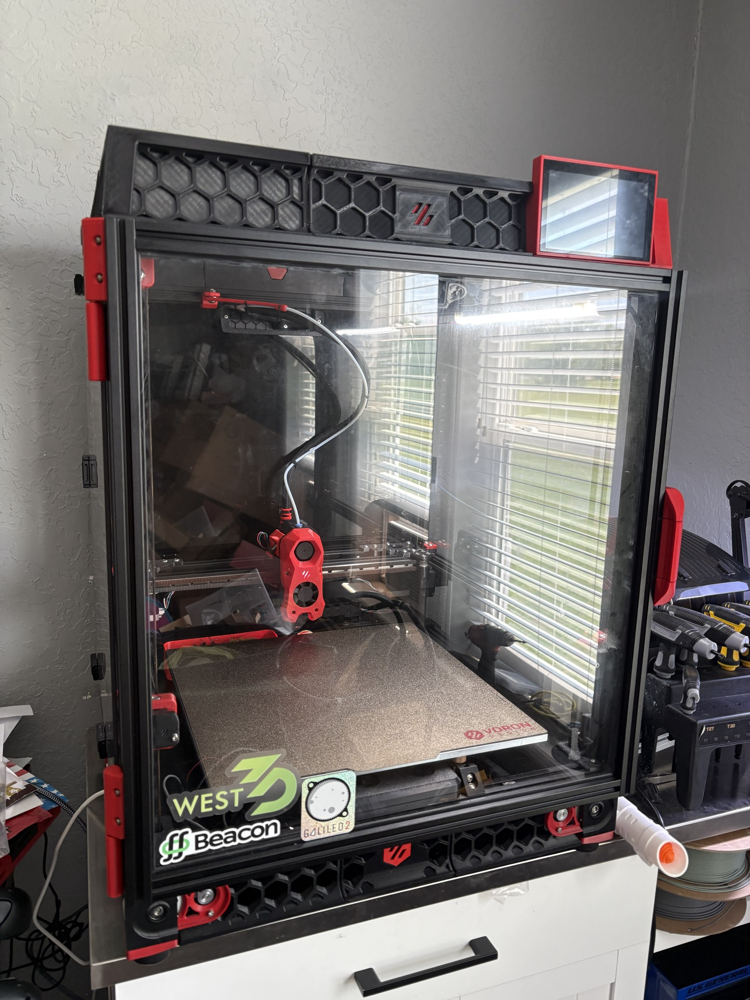

# Voron 2.4 R2 — 350mm

CoreXY build. Galileo 2 direct drive, Stealthburner, CAN toolhead, Pi 5 host. Klipper configs live in [`config/`](./config).

<p align="center">
  
</p>

---

## Specs

| | |
|---|---|
| **Frame** | Voron 2.4 R2, 350 × 350 × 350 |
| **Extruder** | Galileo 2 |
| **Toolhead** | Stealthburner |
| **Nozzle** | Bambu Lab X1C 0.4mm hardened |
| **MCU** | BTT Octopus Pro V1.1 |
| **Toolhead board** | BIGTREETECH EBB SB2209 CAN v1.0 (RP2040) |
| **Host** | Raspberry Pi 5 — 8 GB RAM, NVMe HAT, 1 TB NVMe SSD |
| **Display** | BTT HDMI5 v1.2 |

## Mods

- **Clicky-Klack fridge door** — magnetic front door
- **Top hat canopy** — [Voron 2.4/Trident canopy top hat remix (split)](https://www.printables.com/model/594894-voron-24-trident-canopy-top-hat-remix-split-model)
- **HDMI5 display mount** — [BTT HDMI5 v1.2 mount for top hat canopy](https://www.printables.com/model/1073260-btt-hdmi5-v12-mount-for-my-voron-24-canopy)
- **Printable snap latches** — [Voron mods · 9Rdnf5vD2oaJLmR7BpAuQ](https://mods.vorondesign.com/details/9Rdnf5vD2oaJLmR7BpAuQ)

## Config

```
config/
├── printer.cfg          Klipper machine config
├── moonraker.conf       Moonraker API
├── mainsail.cfg         Mainsail UI
└── KlipperScreen.conf   Touchscreen
```
